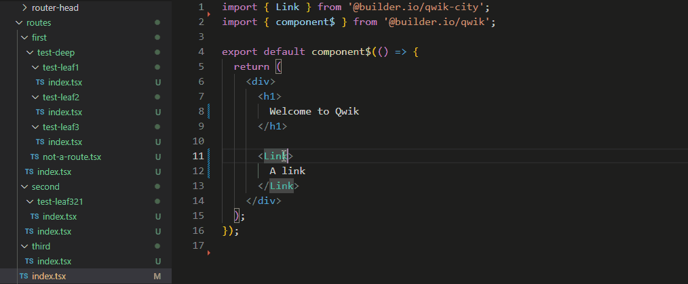

# Qwik City `<Link href>` autocomplete extension

Visual Studio Code extension that provides autocomplete for the `<Link>`'s `href` attribute value based on the `src/routes` directory structure.

## Features

- Automatically provides autocomplete when placing the attribute quotes (`"` or `'`) or a url slash (`/`).
- Caches suggestions and reacts to directory changes.
- Detects the attribute's value borders and replaces it with the chosen suggestion regardless of current cursor position.

## Extension Settings

This extension contributes the following settings:

* `Cache Enabled`: Enable/disable suggestions cache. Cache is purged on changes to folders in the `src/routes` directory.
* `Attributes`: A list of JSX attributes to provide autocomplete in. By default only contains the `href` attribute.

## Contributing

Pull requests and stars are always welcome. ❤\
For bugs and feature requests, [please create an issue](https://github.com/Raiondesu/qwik-city-link-autocomplete/issues/new).
